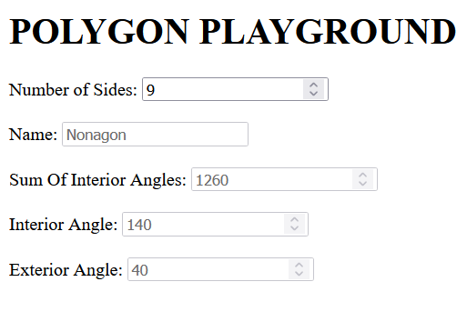

# JS Polygon Playground 📐

A script that can be used to calculate properties of polygons 🔥🔥

## Features ✨

- Ability to find:
  - Sum of interior angles
  - A single interior angle
  - A single exterior angle
  - The name of the polygon(these only go up to 12)

## Installation & Usage 🛠️

1. Clone the repository using `git clone https://github.com/BeanyTheCoder/js-polygons.git`.

2. Navigate to the project directory using `cd  js-polygons`.
3. Open the `index.html` file using any web browser of your choice.

## Screenshots 📷

## Technologies Used 🛠️

- JavaScript
- HTML

## Roadmap 🗺️

I plan to add styling for the html file

## License 📝

This project is licensed under the [License Name](link-to-license-file).

## Contact 📧

For any questions or feedback, feel free to reach out to me at alexanderafoko@gmail.com.

## Project Status

In active development 🔥
